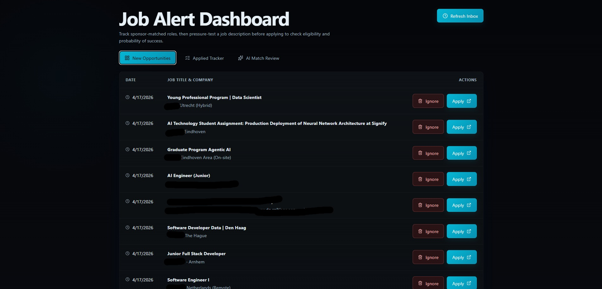
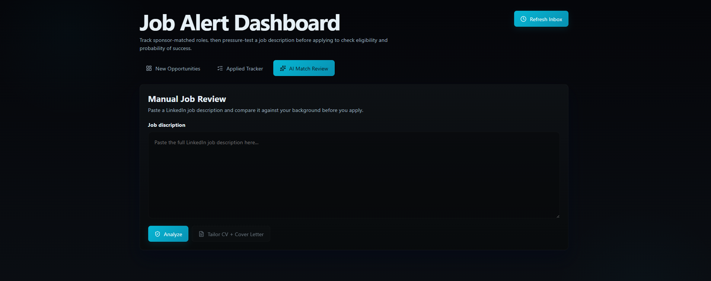

# SponsorScan
**Intelligent job alert filtering for visa-sponsored roles**

SponsorScan is a full-stack application that helps international job seekers identify relevant job opportunities more efficiently. It scans Gmail job alerts, matches companies against a recognized sponsor list, filters out less relevant roles such as internships and thesis positions, stores results in SQLite, and provides AI-assisted job analysis and CV/cover-letter tailoring.

This project was built to solve a practical problem: manually checking large sponsor lists against daily job alerts is slow, repetitive, and easy to miss. SponsorScan turns that process into a structured workflow.

## Demo Preview



## Screenshots

### AI Match Review


### Analysis Results


## Why I built this

As an international job seeker, I needed a faster way to focus on companies that are more likely to support work permit sponsorship. Career services and public records can provide very large sponsor lists, but manually checking thousands of company names against incoming job alerts is inefficient.

SponsorScan automates that process by combining email parsing, sponsor matching, filtering rules, database tracking, and AI-assisted application support.

## Features

- Scan Gmail for recent job-related emails
- Parse email content and extract relevant text and links
- Match companies against a sponsor list
- Filter out internships, thesis roles, and other less relevant entries
- Deduplicate jobs across runs and against recent database history
- Store matched jobs in SQLite for tracking
- Manage application status from the UI
- Analyze job descriptions with AI
- Generate tailored CV and cover-letter suggestions using profile context

## How it works

### 1. Gmail collection

The collector reads recent Gmail messages through the Gmail API using Google OAuth credentials stored locally.

Flow:
- authenticate with Gmail
- fetch messages in a time window
- retrieve full message bodies
- parse text and links from each message

The parsing logic lives in `gmail_client.py`, while orchestration happens in `main.py`.

### 2. Sponsor matching

Sponsor names are loaded from `sponsors.csv` through the sponsor-checking module.

Instead of relying on exact string equality, SponsorScan uses lightweight heuristic matching:
- normalize text
- lowercase values
- remove punctuation and noisy words
- compare relevant tokens and phrases
- inspect nearby lines to separate likely title text from company text
- give preference to lines with job links and sponsor token hits

This makes the matching more practical for noisy email content.

### 3. Filtering and deduplication

To improve relevance, the collector skips roles containing internship/thesis-related keywords such as:
- `intern`
- `internship`
- `stage`
- `afstudeer`
- `thesis`
- `graduation`

It also prevents duplicates in two ways:
- deduplicates within the current collection run
- checks recent entries from the database and skips already-seen `(company, title)` pairs within a recent cutoff window

### 4. Persistence and job tracking

Matched jobs are stored in SQLite so they can be reviewed later in the frontend.

The app supports status tracking such as:
- pending
- applied
- approved
- rejected
- ignored

### 5. AI-assisted analysis and tailoring

The backend includes Anthropic-powered endpoints for analyzing jobs and tailoring application materials.

Using the job description together with profile context files such as:
- `cv.md`
- `courses.md`
- `cover_letter.md`

the app can:

**Analyze a job**
- fit score
- summary
- match reasons
- concerns
- seriousness / legitimacy signals
- recommendation
- suggested next step

**Tailor application materials**
- CV title and summary suggestions
- section-specific notes
- one-page CV draft
- tailored cover letter draft

## Frontend

The React frontend currently supports:
- browsing stored jobs
- refreshing the inbox
- viewing job details
- opening the original job link
- marking a job as applied
- ignoring jobs
- updating status from the UI
- pasting a job description for AI analysis
- generating tailored CV and cover-letter suggestions

## Sponsor verification source

Companies are checked against sponsor reference data based on the Dutch IND public register for regular labour and highly skilled migrants.

## Tech stack

**Backend**
- Python
- FastAPI
- SQLite
- SQLAlchemy
- Gmail API
- Anthropic API

**Frontend**
- React
- CSS

## Project structure

```text
backend/           FastAPI app and API endpoints
frontend/          React frontend
main.py            Collection runner and orchestration
gmail_client.py    Gmail API access and message parsing
sponsor_checker.py Sponsor matching logic
database.py        Database models and session handling
ai_service.py      Anthropic integration
prompts/           Prompt templates
profile/           CV/profile context files
sponsors.csv       Sponsor reference data
```
